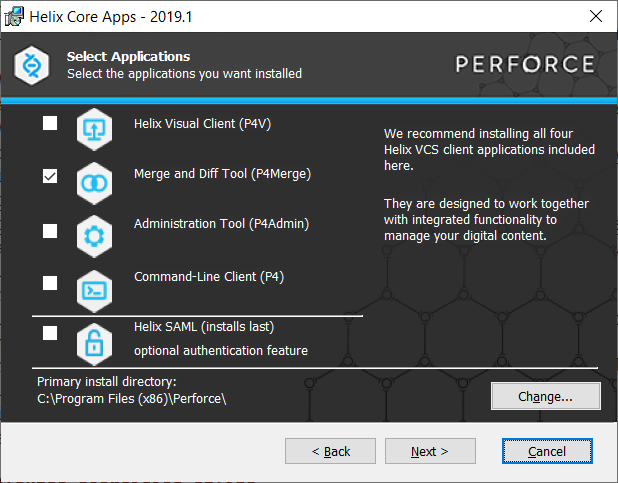

# Ingeniería del Sofware 3 - Práctico

Repositorio Git de Ingeniería del Software 3 - Año 2019

# Tabla de contenidos

  * [Trabajo Práctico 1 - Git Básico](#trabajo-práctico-1---git-básico)
     
  * [Trabajo Práctico 2 - Herramientas de construcción de software](#trabajo-práctico-2---herramientas-de-construcción-de-software)
     
  * [Trabajo Práctico 3 - Software Distribuido - Servicios RESTful](#trabajo-práctico-3---software-distribuido---servicios-restful)
      
  * [Trabajo Práctico 4 - Introducción a Docker](#trabajo-práctico-4---Introducción-a-docker)

  * [Trabajo Práctico 5 - Imágenes de Docker](#trabajo-práctico-5---Imágenes-de-Docker)

  * [Trabajo Práctico 6 - Primeros pasos con Jenkins](Trabajo-Práctico-6---Primeros-pasos-con-Jenkins)

  * [Trabajo Práctico 7 - Herramientas de construcción en la nube](Trabajo-Práctico-7---Herramientas-de-construcción-en-la-nube)

  * [Trabajo Práctico 8 - Métricas de código](Trabajo-Práctico-8---Métricas-de-código)


## Trabajo Práctico 1 - Git Básico

### 1- Objetivos de Aprendizaje
 - Utilizar herramientas de control de configuración de software
 - Familiarizarse con los comandos más utilizados
 - Configurar el repositorio principal de cada alumno para la materia

### 2- Unidad temática que incluye este trabajo práctico
Este trabajo práctico corresponde a la unidad Nº: 4

### 3- Consignas a desarrollar en el trabajo práctico:
  - Los ejercicios representan casos concretos y rutinarios en uso de este tipo de herramientas
  - En los puntos donde corresponda, proveer los comandos de git necesarios para llevar a cabo el punto.
  - Cuando se especifique alguna descripción, realizarlo de la manera más clara posible y con ejemplos cuando sea necesario.

### 4- Desarrollo:

#### 1- Instalar Git
Los pasos y referencias asumen el uso del sistema operativo Windows, en caso otros SO seguir recomendaciones específicas.

  - Bajar e instalar el cliente git. Por ejemplo, desde https://git-scm.com/
  - Bajar e instalar un cliente visual. Por ejemplo, TortoiseGit para Windows o SourceTree para Windows/MAC:
    - https://tortoisegit.org/
    - https://www.sourcetreeapp.com/
    - Lista completa: https://git-scm.com/downloads/guis/

#### 2- Crear un repositorio local y agregar archivos
  - Crear un repositorio local en un nuevo directorio.
  - Agregar un archivo Readme.md, agregar algunas líneas con texto a dicho archivo.
  - Crear un commit y proveer un mensaje descriptivo.

#### 3- Crear un repositorio remoto
  - Crear una cuenta en https://github.com
  - Crear un nuevo repositorio en dicha página (vacío)
  - Asociar el repositorio local creado en el punto 2 al creado en github.
  - Subir los cambios locales a github.

#### 4- Familiarizarse con el concepto de Pull Request
Para algunos de los puntos proveer imágenes.

  - Explicar que es un pull request.
  - Crear un branch local y agregar cambios a dicho branch. 
  - Subir el cambio a dicho branch y crear un pull request.
  - Completar el proceso de revisión en github y mergear el PR al branch master.

#### 5- Mergear código con conflictos
  - Instalar alguna herramienta de comparación. Idealmente una 3-Way:
    - P4Merge https://www.perforce.com/downloads/visual-merge-tool:

    - Se puede omitir registración. Instalar solo opcion Merge and DiffTool.

- ByondCompare trial version https://www.scootersoftware.com/download.php
  - Configurar Tortoise/SourceTree para soportar esta herramienta.
    - https://www.scootersoftware.com/support.php?zz=kb_vcs
    - https://medium.com/@robinvanderknaap/using-p4merge-with-tortoisegit-87c1714eb5e2
  - Clonar en un segundo directorio el repositorio creado en github.
  - En el clon inicial, modificar el Readme.md agregando más texto.
  - Hacer commit y subir el cambio a master a github.
  - En el segundo clon también agregar texto, en las mismas líneas que se modificaron el punto anterior.
  - Intentar subir el cambio, haciendo un commit y push. Mostrar el error que se obtiene.
  - Hacer pull y mergear el código (solo texto por ahora), mostrar la herramienta de mergeo como luce.
  - Resolver los conflictos del código.
  - Explicar las versiones LOCAL, BASE y REMOTE.
  - Pushear el cambio mergeado.

#### 6- Algunos ejercicios online
  - Entrar a la página https://learngitbranching.js.org/
  - Completar los ejercicios **Introduction Sequence**
  - Opcional - Completar el resto de los ejercicios para ser un experto en Git!!!

#### 7- Crear Repositorio de la materia
  - Crear un repositorio para la materia en github. Por ejemplo **ing-software-3**
  - Subir archivo(s) .md con los resultados e imágenes de este trabajo práctico. Puede ser en una subcarpeta **trabajo-practico-01**


### Referencias

- https://try.github.io/
- https://github.github.com/training-kit/downloads/es_ES/github-git-cheat-sheet.pdf
- https://github.com/adam-p/markdown-here/wiki/Markdown-Cheatsheet


## Trabajo Práctico 2 - Herramientas de construcción de software

### 1- Objetivos de Aprendizaje
 - Utilizar herramientas de construcción de software y manejo de paquetes y dependencias
 - Familiarizarse con las herramientas más utilizadas en el lenguaje Java.

### 2- Unidad temática que incluye este trabajo práctico
Este trabajo práctico corresponde a la unidad Nº: 4 (Libro Continuous Delivery: Cap 6 y 13)

### 3- Consignas a desarrollar en el trabajo práctico:
  - Las aplicaciones utilizadas son del tipo "Hello World", dado que el foco del trabajo práctico es como construirlas y no el funcionamiento de la aplicación en sí.
  - La mayoría de los ejercicios se realizarán en clase con asistencia del Jefe de trabajos prácticos.
  - En los puntos en los que se pida alguna descripción, realizarlo de la manera más clara posible.

### 4- Desarrollo:

#### 1- Instalar Java JDK si no dispone del mismo. 
  - Java 8 es suficiente, pero puede utilizar cualquier versión.
  - Utilizar el instalador que corresponda a su sistema operativo 
  - http://www.oracle.com/technetwork/java/javase/downloads/jdk8-downloads-2133151.html
  - Agregar la variable de entorno JAVA_HOME
    - En Windows temporalmente se puede configurar
    ```bash
      SET JAVA_HOME=C:\Program Files\Java\jdk1.8.0_221
    ```
    - O permanentemente entrando a **Variables de Entorno** (Winkey + Pausa -> Opciones Avanzadas de Sistema -> Variables de Entorno)
  - Otros sistemas operativos:
    - https://www3.ntu.edu.sg/home/ehchua/programming/howto/JDK_Howto.html
    - https://www.digitalocean.com/community/tutorials/how-to-install-java-with-apt-on-ubuntu-18-04


#### 2- Instalar Maven
- Instalar maven desde https://maven.apache.org/download.cgi (última versión disponible 3.6.1)
- Descomprimir en una carpeta, por ejemplo C:\tools
- Agregar el siguiente directorio a la variable de entorno PATH, asumiendo que los binarios de ant estan en C:\tools\apache-maven-3.6.1\bin

  ```bash   
    SET PATH=%PATH%;C:\tools\apache-maven-3.6.1\bin
  ```  
- Se puede modificar permanentemente la variable PATH entrando a (Winkey + Pausa -> Opciones Avanzadas de Sistema -> Variables de Entorno)
- En Linux/Mac se puede agregar la siguiente entrada al archivo ~/.bash_profile

  ```bash
  export PATH=/opt/apache-maven-3.6.1/bin:$PATH
  ```

#### 3- Introducción a Maven
- Qué es Maven?
- Qué es el archivo POM?
    1. modelVersion
    2. groupId
    3. artifactId
    4. versionId
- Repositorios Local, Central y Remotos http://maven.apache.org/guides/introduction/introduction-to-repositories.html
- Entender Ciclos de vida de build
  - default
  - clean
  - site
  - Referencia: http://maven.apache.org/guides/introduction/introduction-to-the-lifecycle.html#Build_Lifecycle_Basics
- Comprender las fases de un ciclo de vida, por ejemplo, default:

| Fase de build | Descripción                                                                                                                            |
|---------------|----------------------------------------------------------------------------------------------------------------------------------------|
| validate      | valida si el proyecto está correcto y toda la información está disponible                                                             |
| compile       | compila el código fuente del proyecto                                                                                 |
| test          | prueba el código fuente compilado utilizando un marco de prueba de unidad adecuado. Estas pruebas no deberían requerir que el código se empaquete o implemente |
| package       | toma el código compilado y lo empaquéta en su formato distribuible, como un JAR.                                                     |
| verify        | ejecuta cualquier verificación de los resultados de las pruebas de integración para garantizar que se cumplan los criterios de calidad                                                      |
| install       | instal1 el paquete en el repositorio local, para usarlo como dependencia en otros proyectos localmente                                       |
| deploy        | hecho en el entorno de compilación, copia el paquete final en el repositorio remoto para compartirlo con otros desarrolladores y proyectos.      |

- Copiar el siguiente contenido a un archivo, por ejemplo ./trabajo-practico-02/maven/vacio/pom.xml

```xml
<project xmlns="http://maven.apache.org/POM/4.0.0"
         xmlns:xsi="http://www.w3.org/2001/XMLSchema-instance"
         xsi:schemaLocation="http://maven.apache.org/POM/4.0.0
                      http://maven.apache.org/xsd/maven-4.0.0.xsd">
    <modelVersion>4.0.0</modelVersion>

    <groupId>ar.edu.ucc</groupId>
    <artifactId>proyecto-01</artifactId>
    <version>0.1-SNAPSHOT</version>
</project>
```

- Ejecutar el siguiente comando en el directorio donde se encuentra el archivo pom.xml
```
mvn clean install
```

- Sacar conclusiones del resultado

#### 4- Maven Continuación

- Generar un proyecto con una estructura inicial:

```bash
mvn archetype:generate -DgroupId=ar.edu.ucc -DartifactId=ejemplo -DarchetypeArtifactId=maven-archetype-quickstart -DinteractiveMode=false
```

- Analizar la estructura de directorios generada:

```
.
└── ejemplo
    ├── pom.xml
    └── src
        ├── main
        │   └── java
        │       └── ar
        │           └── edu
        │               └── ucc
        │                   └── App.java
        └── test
            └── java
                └── ar
                    └── edu
                        └── ucc
                            └── AppTest.java

12 directories, 3 files
```

- Compilar el proyecto

```bash
mvn clean package
```

- Analizar la salida del comando anterior y luego ejecutar el programa

```
java -cp target/ejemplo-1.0-SNAPSHOT.jar ar.edu.ucc.App
```

#### 6- Manejo de dependencias

- Crear un nuevo proyecto con artifactId **ejemplo-uber-jar**

- Modificar el código de App.java para agregar utilizar una librería de logging:

```java
package ar.edu.ucc;

import org.slf4j.Logger;
import org.slf4j.LoggerFactory;

/**
 * Hello world!
 *
 */
public class App 
{
    public static void main( String[] args )
    {
        Logger log = LoggerFactory.getLogger(App.class);
        log.info("Hola Mundo!");
    }
}
```

- Compilar el código e identificar el problema.

- Agregar la dependencia necesaria al pom.xml

```xml
    <dependency>
      <groupId>ch.qos.logback</groupId>
      <artifactId>logback-classic</artifactId>
      <version>1.2.1</version>
    </dependency>
```

- Verificar si se genera el archivo jar y ejecutarlo

```bash
java -cp target\ejemplo-uber-jar-1.0-SNAPSHOT.jar ar.edu.ucc.App
```

- Sacar conclusiones y analizar posibles soluciones

- Implementar la opción de uber-jar: https://maven.apache.org/plugins/maven-shade-plugin/

```xml
  <build>
    <plugins>
      <plugin>
        <groupId>org.apache.maven.plugins</groupId>
        <artifactId>maven-shade-plugin</artifactId>
        <version>2.0</version>
        <executions>
          <execution>
            <phase>package</phase>
            <goals>
              <goal>shade</goal>
            </goals>
            <configuration>
              <finalName>${project.artifactId}</finalName>
              <transformers>
                <transformer implementation="org.apache.maven.plugins.shade.resource.ManifestResourceTransformer">
                  <mainClass>ar.edu.ucc.App</mainClass>
                </transformer>
              </transformers>
              <minimizeJar>false</minimizeJar>
            </configuration>
          </execution>
        </executions>
      </plugin>
    </plugins>
  </build>
```
- Volver a generar la salida y probar ejecutando

```bash
java -jar target\ejemplo-uber-jar.jar
```

#### 7- Utilizar una IDE
  - Importar el proyecto anterior en Eclipse o Intellij como maven project:
    - Si no dispone de Eclipse puede obtenerlo desde este link http://www.eclipse.org/downloads/packages/release/2018-09/r/eclipse-ide-java-ee-developers
    - Para importar, ir al menú Archivo -> Importar -> Maven -> Proyecto Maven Existente:

    - Seleccionar el directorio donde se encuentra el pom.xml que se generó en el punto anterior. Luego continuar:


  - Familiarizarse con la interfaz grafica
    - Ejecutar la aplicación
    - Debugear la aplicación
    - Correr unit tests y coverage
    - Ejecutar los goals de maven
    - Encontrar donde se puede cambiar la configuración de Maven.
    - etc.

#### 8- Build tools para otros lenguages
- Hacer una lista de herramientas de build (una o varias) para distintos lenguajes, por ejemplo (Rust -> cargo)
- Elegir al menos 10 lenguajes de la lista de top 20 o top 50 de tiobe: https://www.tiobe.com/tiobe-index/


#### 9- Ejemplo con nodejs (Opcional, pero recomendando)

- Instalar Nodejs: https://nodejs.org/en/

- Instalar el componente para generar aplicaciones Express

```bash
npm install express-generator -g
```

- Crear una nueva aplicación
```bash
express --view=ejs hola-mundo
```

- Ejecutar la aplicación

```bash
cd hola-mundo
npm install
npm start
```

- La aplicación web estará disponible en http://localhost:3000

- Analizar el manejo de paquetes y dependencias realizado por npm.


#### 10- Presentación

- Subir todo el código, ejemplos y respuestas a una carpeta trabajo-practico-02.

> Tip: Agregar un archivo .gitignore al repositorio para evitar que se agreguen archivos que son resultado de la compilación u otros binarios, que no son necesarios, al mismo.

## Trabajo Práctico 3 - Software Distribuido - Servicios RESTful

### 1- Objetivos de Aprendizaje
 - Adquirir conocimientos sobre conceptos referidos a Servicios RESTful.
 - Analizar e implementar una aplicación utilizando el framework Spring Boot

### 2- Unidad temática que incluye este trabajo práctico
Este trabajo práctico corresponde a la unidad Nº: 8 

### 3- Consignas a desarrollar en el trabajo práctico:
Utilizaremos como guía el siguiente tutorial de Spring Boot: https://spring.io/guides/tutorials/rest/

### 4- Desarrollo:

#### 1- Configurar el IDE para trabajar con Spring
  - Eclipse:
    - Instalar el **Spring Tools 4** desde Eclipse Marketplace (Menú Ayuda -> Eclipse Marketplace, y buscar Spring)
       ![alt text][imagen1] 

        [imagen1]: imagenes/spring-install.png
    - Instalar lombok, siguiendo los pasos: https://projectlombok.org/setup/eclipse
  - IntelliJ
    - Instalar lombok, siguiendo los pasos: https://projectlombok.org/setup/intellij

#### 2- Configurar la aplicación
  - Clonar el siguiente repositorio: https://github.com/spring-guides/tut-rest
  - Copiar el ./pom.xml y la carpeta nonrest a una nueva carpeta en nuestro repositorio, por ejemplo ./payroll
  - Renombrar nonrest a server en nuestro repositorio.
  - Agregar los archivos a git y generar un nuevo commit.
  - Compilar el código (desde la raíz del repositorio):
    ```
       cd payroll/server
       mvn clean package spring-boot:repackage       
       mvn spring-boot:run
     ```
  - Importar el proyecto en el IDE (Elclipse o IntelliJ)
  - Ejecutar el sub-proyecto nonrest y ver que está disponible en http://localhost:8080

#### 3- Analizar el proyecto
  - Analizar el código del proyecto ./payroll/server, siguiendo el tutorial arriba mencionado
  - Obtener la lista de empleados
```bash
curl -v localhost:8080/employees
```
  - Agregar un empleado
  - Borrar un empleado

#### 4- Agregando el proyecto RESTful
  - Copiar el contenido de la carpeta rest a la carpeta ./payroll/server
  - Agregar los archivos a git y generar un nuevo commit.
  - Analizar nuevamente el proyecto payroll-server, siguiendo el tutorial.
  - Entender las diferencias entre nonrest y rest

#### 5- Agregando el proyecto evolution
  - Copiar el contenido de la carpeta evolution a la carpeta ./payroll/server
  - Agregar los archivos a git y generar un nuevo commit.
  - Entender como funciona ```ResourceAssembler```

#### 6- Agregando el proyecto links
  - Copiar el contenido de la carpeta links a la carpeta ./payroll/server
  - Agregar los archivos a git y generar un nuevo commit.
  - Aquí vemos una implementación con más funcionalidad, revisar el código
  - Ejecutar comandos curl para obtener
     - Lista de ordenes
     - Lista de empleados
     - Crear una orden
     - Completar la orden
     - Crear otra orden y cancelarla.

#### 7- Agregar Customers
  - En el proyecto links agregar funcionalidad para soportar customers
    - Entity
    - Repository
    - Controller
    - etc..
  - No es necesario vincularlos a la clase **Order**
  - Probar los diferentes métodos con curl.

## Trabajo Práctico 4 - Introducción a Docker

### 1- Objetivos de Aprendizaje
 - Familiarizarse con la tecnología de contendores 
 - Ejercitar comandos básicos de Docker.

### 2- Unidad temática que incluye este trabajo práctico
Este trabajo práctico corresponde a la unidad Nº: 9 (Libro Building Microservices: Cap 6)

### 3- Consignas a desarrollar en el trabajo práctico:

A continuación, se presentarán algunos conceptos generales de la tecnología de contenedores a manera de introducción al tema desde el punto de vista práctico.

#### Que son los contenedores?

Los contenedores son paquetes de software. Ellos contienen la aplicación a ejecutar junto con las librerías, archivos de configuración, etc para que esta aplicación pueda ser ejecutada. Estos contenedores utilizan características del sistema operativo, por ejemplo, cgroups, namespaces y otros aislamientos de recursos (sistema de archivos, red, etc) para proveer un entorno aislado de ejecución de dicha aplicación.

Dado que ellos utilizan el kernel del sistema operativo en el que se ejecutan, no tienen el elevado consumo de recursos que por ejemplo tienen las máquinas virtuales, las cuales corren su propio sistema operativo.

#### Que es docker?

Docker es una herramienta que permite el despliegue de aplicaciones en contenedores. Además, provee una solución integrada tanto para la ejecución como para la creación de contenedores entre otras muchas funcionalidades.

#### Porque usar contenedores?

Los contenedores ofrecen un mecanismo de empaquetado lógico en el cual las aplicaciones pueden estar aisladas del entorno en el cual efectivamente se ejecutan. Este desacoplamiento permite a las aplicaciones en contenedores ser desplegadas de manera simple y consistente independientemente de si se trata de un Data Center privado, una Cloud publica, o una computadora de uso personal. Esto permite a los desarrolladores crear entornos predecibles que están aislados del resto de las aplicaciones y pueden ser ejecutados en cualquier lugar.

Por otro lado, ofrecen un control más fino de los recursos y son más eficientes al momento de la ejecución que una máquina virtual.

En los últimos años el uso de contenedores ha crecido exponencialmente y fue adoptado de forma masiva por prácticamente todas las compañías importantes de software.

#### Máquinas Virtuales vs Contenedores 

Los contenderos no fueron pensados como un remplazo de las máquinas virtuales. Cuando ambas tecnologías se utilizan en forma conjunta se obtienen los mejores resultados, por ejemplo, en los proveedores cloud como AWS, Google Cloud o Microsoft Azure.

![alt text][imagen]

[imagen]: imagenes/virtualbox-vs-container.png

#### Conceptos Generales

- **Container Image**: Una imagen contiene el sistema operativo base, la aplicación y todas sus dependencias necesarias para un despliegue rápido del contenedor.
- **Container**: Es una instancia en ejecución de una imagen.
- **Container Registry**: Las imágenes de Docker son almacenadas en un Registry y pueden ser descargadas cuando se necesitan. Un registry pude ser público, por ejemplo, DockerHub o instalado en un entorno privado.
- **Docker Daemon**: el servicio en segundo plano que se ejecuta en el host que gestiona la construcción, ejecución y distribución de contenedores Docker. El daemon es el proceso que se ejecuta en el sistema operativo con el que los clientes hablan.
- **Docker Client**: la herramienta de línea de comandos que permite al usuario interactuar con el daemon. En términos más generales, también puede haber otras formas de clientes, como Kitematic, que proporciona una GUI a los usuarios. 
- **Dockerfile**: Son usados por los desarrolladores para automatizar la creación de imágenes de containedores. Con un Dockerfile, el demonio de Docker puede automáticamente construir una imagen.

## 4- Desarrollo:

#### 1- Instalar Docker Community Edition 
  - Diferentes opciones para cada sistema operativo
  - https://docs.docker.com/
  - Ejecutar el siguiente comando para comprobar versiones de cliente y demonio.
```bash
docker version
```

#### 2- Explorar DockerHub
   - Registrase en docker hub: https://hub.docker.com/
   - Familiarizarse con el portal

#### 3- Obtener la imagen BusyBox
  - Ejecutar el siguiente comando, para bajar una imagen de DockerHub
  ```bash
  docker pull busybox
  ```
  - Verificar qué versión y tamaño tiene la imagen bajada, obtener una lista de imagenes locales:
```bash
docker images
```

#### 4- Ejecutando contenedores
  - Ejecutar un contenedor utilizando el comando **run** de docker:
```bash
docker run busybox
```

  - Explicar porque no se obtuvo ningún resultado

  - Especificamos algún comando a correr dentro del contendor, ejecutar por ejemplo:
```bash
docker run busybox echo "Hola Mundo"
```

  - Ver los contendores ejecutados utilizando el comando **ps**:
```bash
docker ps
```
  - Vemos que no existe nada en ejecución, correr entonces:
```bash
docker ps -a
```
  - Mostrar el resultado y explicar que se obtuvo como salida del comando anterior.

#### 5- Ejecutando en modo interactivo

  - Ejecutar el siguiente comando
```bash
docker run -it busybox sh
```
  - Para cada uno de los siguientes comandos dentro de contenedor, mostrar los resultados:
```bash
ps
uptime
free
ls -l /
```
  - Salimos del contendor con:
```bash
exit
```

#### 6- Borrando contendores terminados

  - Obtener la lista de contendores 
```bash
docker ps -a
```
  - Para borrar podemos utilizar el id o el nombre (autogenerado si no se especifica) de contendor que se desee, por ejemplo:
```bash
docker rm elated_lalande
```
  - Para borrar todos los contendores que no estén corriendo, ejecutar cualquiera de los siguientes comandos:
```bash
docker rm $(docker ps -a -q -f status=exited)
```
```bash
docker container prune
```

#### 7- Montando volúmenes

Hasta este punto los contenedores ejecutados no tenían contacto con el exterior, ellos corrían en su propio entorno hasta que terminaran su ejecución. Ahora veremos como montar un volumen dentro del contenedor para visualizar por ejemplo archivos del sistema huesped:

  - Ejecutar el siguiente comando, cambiar myusuario por el usuario que corresponda. En linux/Mac puede utilizarse /home/miusuario):
```bash
docker run -it -v C:\Users\misuario\Desktop:/var/escritorio busybox /bin/sh
```
  - Dentro del contenedor correr
```bash
ls -l /var/escritorio
touch /var/escritorio/hola.txt
```
  - Verificar que el Archivo se ha creado en el escritorio o en el directorio home según corresponda.

#### 8- Publicando puertos

En el caso de aplicaciones web o base de datos donde se interactúa con estas aplicaciones a través de un puerto al cual hay que acceder, estos puertos están visibles solo dentro del contenedor. Si queremos acceder desde el exterior deberemos exponerlos.

  - Ejecutar la siguiente imagen, en este caso utilizamos la bandera -d (detach) para que nos devuelva el control de la consola:

```bash
docker run -d daviey/nyan-cat-web
```
  - Si ejecutamos un comando ps:
```bash
PS D:\> docker ps
CONTAINER ID        IMAGE                 COMMAND                  CREATED             STATUS              PORTS               NAMES
87d1c5f44809        daviey/nyan-cat-web   "nginx -g 'daemon of…"   2 minutes ago       Up 2 minutes        80/tcp, 443/tcp     compassionate_raman
```
  - Vemos que el contendor expone 2 puertos el 80 y el 443, pero si intentamos en un navegador acceder a http://localhost no sucede nada.

  - Procedemos entonces a parar y remover este contenedor:
```bash
docker kill compassionate_raman
docker rm compassionate_raman
```
  - Vamos a volver a correrlo otra vez, pero publicando uno de los puertos solamente, el este caso el 80

```bash
docker run -d -p 80:80 daviey/nyan-cat-web
```
  - Accedamos nuevamente a http://localhost y expliquemos que sucede.

#### 8- Presentación del trabajo práctico.

Subir un archivo **trabajo-practico-04.md** con las salidas de los comandos utilizados. Si es necesario incluir también capturas de pantalla.


## Trabajo Práctico 5 - Imágenes de Docker

### 1- Objetivos de Aprendizaje
 - Adquirir conocimientos para construir y publicar imágenes de Docker.
 - Familiarizarse con el vocabulario.

### 2- Unidad temática que incluye este trabajo práctico
Este trabajo práctico corresponde a la unidad Nº: 4 

### 3- Consignas a desarrollar en el trabajo práctico:
 - Los ejercicios se realizarán en clase con asistencia del Jefe de trabajos prácticos.
 - En los puntos en los que se pida alguna descripción, realizarlo de la manera más clara posible.

### 4- Desarrollo:

#### 1- Conceptos de Dockerfiles
  - Leer https://docs.docker.com/engine/reference/builder/ (tiempo estimado 2 horas)
  - Describir las instrucciones
     - FROM
     - RUN
     - ADD
     - COPY
     - EXPOSE
     - CMD
     - ENTRYPOINT

#### 2- Generar imagen de docker
   - Utilizar el código de la carpeta ./payroll/server
   - Compilar la salida con:
```bash
 mvn clean package spring-boot:repackage  
```
   - Agregar el siguiente Dockerfile
```Dockerfile
FROM openjdk:8-jre-alpine

RUN apk add --no-cache bash

WORKDIR /opt

COPY target/*-SNAPSHOT.jar .

ENV JAVA_OPTS="-Xms32m -Xmx128m"

ENTRYPOINT exec java $JAVA_OPTS -jar ejemplo.jar
```
   - Generar la imagen de docker con el comando build
```bash
docker build -t test-java .
```
  - Ejecutar el contenedor
```bash
docker run test-java
```
  - Capturar y mostrar la salida.

#### 3- Imagen para aplicación web en Nodejs
  - Crear una la carpeta trabajo-practico-05/nodejs-docker
  - Generar un proyecto siguiendo los pasos descriptos en el trabajo práctico 2 para Nodejs
  - Escribir un Dockerfile para ejecutar la aplicación web localizada en ese directorio
    - Usar como imagen base **node:8.11-alpine**
    - Ejecutar **npm install** dentro durante el build.
    - Exponer el puerto 3000
  - Hacer un build de la imagen, nombrar la imagen **test-node**.
  - Ejecutar la imagen **test-node** publicando el puerto 3000.
  - Verificar en http://localhost:3000 que la aplicación está funcionando.
  - Proveer el Dockerfile y los comandos ejecutados como resultado de este ejercicio.

#### 4- Publicar la imagen en Docker Hub.
  - Crear una cuenta en Docker Hub si no se dispone de una.
  - Registrase localmente a la cuenta de Docker Hub:
```bash
docker login
```
  - Crear un tag de la imagen generada en el ejercicio 3. Reemplazar <mi_usuario> por el creado en el punto anterior.
```bash
docker tag test-node <mi_usuario>/test-node:latest
```
  - Subir la imagen a Docker Hub con el comando
```bash
docker push <mi_usuario>/test-node:latest
``` 
  - Como resultado de este ejercicio mostrar la salida de consola, o una captura de pantalla de la imagen disponible en Docker Hub.

## Trabajo Práctico 6 - Primeros pasos con Jenkins

### 1- Objetivos de Aprendizaje
 - Adquirir conocimientos acerca de las herramientas de integración continua.
 - Configurar este tipo de herramientas.
 - Implementar procesos de construcción automatizado simples.

### 2- Unidad temática que incluye este trabajo práctico
Este trabajo práctico corresponde a la unidad Nº: 4 (Libro Continuous Delivery: Cap 3)

### 3- Consignas a desarrollar en el trabajo práctico:
 - Los ejercicios se realizarán en clase con asistencia del Jefe de trabajos prácticos.
 - Para una mejor evaluación del trabajo práctico, incluir capturas de pantalla de los pasos donde considere necesario.

### 4- Desarrollo:

#### 1- Poniendo en funcionamiento Jenkins
  - Bajar la aplicación y ejecutarla (ejemplo para Windows):
```bash

mkdir -p C:\jenkins\data
cd C:\jenkins

wget http://mirrors.jenkins.io/war-stable/latest/jenkins.war

SET JENKINS_HOME=C:\jenkins\data

java -jar jenkins.war --httpPort=8081
```
  - Se puede también ejecutar en contenedor de Jenkins (tamaño de imagen de docker ~700mb):

```bash
# Windows

mkdir -p C:\jenkins\data
docker run -d -p 8081:8080 -p 50000:50000 -v C:\jenkins\data:/var/jenkins_home jenkins/jenkins:lts
```

```bash
# Linux / Mac OS

mkdir -p ~/jenkins/data
docker run -d -p 8081:8080 -p 50000:50000 -v ~/jenkins/data:/var/jenkins_home jenkins/jenkins:lts
```
  - Una vez en ejecución, abrir http://localhost:8081
  - Inicialmente deberá especificar el texto dentro del archivo C:\jenkins\data\secrets\initialAdminPassword
  - Instalar los plugins por defecto
  - Crear el usuario admin inicial. Colocar cualquier valor que considere adecuado.

#### 2- Conceptos generales
  - Junto al Jefe de trabajos prácticos:
    - Explicamos los diferentes componentes que vemos en la página principal
    - Analizamos las opciones de administración de Jenkins

#### 3- Instalando Plugins y configurando herramientas
  - En Administrar Jenkins vamos a la sección de Administrar Plugins
  - De la lista de plugins disponibles instalamos **Maven Integration plugin**
  - Instalamos sin reiniciar el servidor.
  - Abrir nuevamente página de Plugins y explorar la lista, para familiarizarse qué tipo de plugins hay disponibles.
  - En la sección de administracion abrir la opción de configuracion de herramientas
  - Agregar maven con el nombre de **M3** y que se instale automáticamente.

#### 4- Creando el primer Pipeline Job
  - Crear un nuevo item, del tipo Pipeline con nombre **hello-world**
  - Una vez creado el job, en la sección Pipeline seleccionamos **try sample Pipeline** y luego **Hello World**
  - Guardamos y ejecutamos el Job
  - Analizar la salida del mismo
 
#### 5- Creando un Pipeline Job con Git y Maven
  - Similar al paso anterior creamos un ítem con el nombre **simple-maven**
  - Elegir **Git + Maven** en la seccion **try sample Pipeline**
  - Guardar y ejecutar el Job
  - Analizar el script, para identificar los diferentes pasos definidos y correlacionarlos con lo que se ejecuta en el Job y se visualiza en la página del Job.

#### 6- Utilizando nuestros proyectos
  - Utilizando lo aprendido en el ejercicio 5
    - Crear un Job que construya el proyecto **./payroll/server** del trabajo práctico 2.
    - Obtener el código desde el repositorio de cada alumno (se puede crear un repositorio nuevo en github que contenga solamente el proyecto maven).
    - Generar y publicar los artefactos que se producen.
  - Como resultado de este ejercicio proveer el script en el archivo **./payroll/server/Jenkinsfile**

## Trabajo Práctico 7 - Herramientas de construcción en la nube
### 1- Objetivos de Aprendizaje
 - Adquirir conocimientos acerca de las herramientas de integración continua en la nube.
 - Configurar este tipo de herramientas.
 - Implementar procesos simples de construcción automatizada.

### 2- Unidad temática que incluye este trabajo práctico
Este trabajo práctico corresponde a la unidad Nº: 4 (Libro Continuous Delivery: Cap 3)

### 3- Consignas a desarrollar en el trabajo práctico:
 - Los ejercicios se realizarán en clase con asistencia del Jefe de trabajos prácticos.
 - Para una mejor evaluación del trabajo práctico, incluir capturas de pantalla de los pasos donde considere necesario.
 - En este caso existen varias herramientas con funcionalidades similares en la nube:
   - [AppVeyor](https://www.appveyor.com/)   
   - [CircleCI](https://circleci.com/)
   - [Travis CI](https://travis-ci.com/)

## 4- Desarrollo:

#### 1- Pros y Contras
  - Listar los pros y contras de este tipo de herramientas
  - Sacar conclusiones

#### 2- Configurando AppVeyor
  - Crear una cuenta en AppVeyor, se puede utilizar el usuario de GitHub
  - Configurar un proyecto utilizando un repositorio que contenga el código del proyecto Maven **./payroll/server**.
  - Ir a la opción **SETTINGS**
  - Dejar el entorno por defecto (Visual Studio 2015)
  - En la opción **Build** configurar un script de línea de comando (CMD), para que genere los artefactos. Es posible que tenga que cambiar de directorio para generación:
```
cd <lugar donde está el pom.xml>
mvn clean package
```
  - En la opción Artifacts especificar la ruta relativa para capturar los jar files de salida.
  - Verificar que el Job se ejecuta con nuevos commits en el repositorio configurado.
  - Opcional: Agregar Badges al repositorio para mostrar estado actual del build en GitHub.
  - Como resultado de este ejercicio, exportar el yaml generado y subirlo en **./payroll/server/appveyor.yml**. Y mostrar capturas de pantalla con los artefactos y/o la historia de los builds ejecutados.

#### 3- Opcional: Configurando CircleCI
  - De manera similar al ejercicio 2, configurar un build job para el mismo proyecto, pero utilizando CircleCI
  - Para capturar artefactos, utilizar esta referencia: https://circleci.com/docs/2.0/artifacts/
  - Como resultado de este ejercicio, subir el config.yml a la carpeta **./payroll/server**

#### 4- Opcional: Configurando TravisCI
  - Configurar el mismo proyecto, pero para TravisCI. No es necesario publicar los artefactos porque TravisCI no dispone de esta funcionalidad.
  - Como resultado de este ejercicio subir el archivo .travis.yml a la carpeta **./payroll/server**

#### 5- Conclusiones.
  - Hacer una breve descripción comparativa entre AppVeyor, CircleCI y TravisCI


## Trabajo Práctico 8 - Métricas de código
### 1- Objetivos de Aprendizaje
 - Adquirir conocimientos acerca del uso de herramientas para análisis estático de código.
 - Configurar este tipo de herramientas.
 - Prevención y corrección de errores.

### 2- Unidad temática que incluye este trabajo práctico
Este trabajo práctico corresponde a la unidad Nº: 5 (Libro Ingeniería de Software: Cap 24)

### 3- Consignas a desarrollar en el trabajo práctico:
 - Los ejercicios se realizarán en clase con asistencia del Jefe de trabajos prácticos.
 - Para una mejor evaluación del trabajo práctico, incluir capturas de pantalla de los pasos donde considere necesario.
 - En este caso existen varias herramientas con funcionalidades similares en la nube:
   - [SonarClould](https://sonarcloud.io)   
   - [Codacy](https://www.codacy.com/)

### 4- Desarrollo:

#### 1- Configurando SonarCloud
  - Crear una cuenta en SonarCloud, se puede utilizar el usuario de GitHub.
  - Hacer un fork del repositorio https://github.com/alexisfr/java-projects
  - Clonar el repositorio al que se le hizo el fork.
  - En SonarCloud crear un nuevo proyecto (haciendo click en el botón +)
  - Elegir la opción de analizar nuevo projecto.
  - Completar las opciones para crear una nueva Organizacion (se puede usar su cuenta de github).
  - Seleccionar el repositorio java-projects de su usuario y presionar **Set up**

#### 2- Correr Análisis de código
  - Una vez creado el proyecto, se debe elegir la opción de analisis manual
  - Seleccionar Maven.
  - Correr el comando generado en la raíz del repositorio clonado locamente, hay que agregar la opción **-Dmaven.test.failure.ignore=true** al final del comando, algo similar a esto:
```bash
mvn sonar:sonar \
  -Dsonar.projectKey=alexisfr_java-projects \
  -Dsonar.organization=alexisfr-github \
  -Dsonar.host.url=https://sonarcloud.io \
  -Dsonar.login=XXX \
  -Dmaven.test.failure.ignore=true
```
  - Esta ejecución puede tomar varios minutos.
  - Guardar este comando, que luego será utilizado.

#### 3- Analizar los resultados de Fiabilidad
  - Encontrar los 3 Bugs en la clase **basics/swing/FileIO** referidos a Fiabilidad (Reliability).
  - Explicar porque se consideran errores y posible solución a los mismos.

#### 4- Analizar las Vulnerabilidades de Seguridad
  - Encontrar los 4 Errores de seguridad en la clase **basics/jdbc/mysql/MySQLAccess.java**
  - Explicar porque se considera código vulnerable y posible solución a los mismos.

#### 5- Analizar costo de Mantenimiento
  - Describir alguno de los "Code Smells" en la clase basics/swing/demo/calculator/Calculator.java
  - ¿Cuánto tiempo estimado es necesario para llevar esta clase de calificación **B** a calificación **A** de acuerdo a esta herramienta?

#### 6- Analizar Complejidad
  - Encontrar la función que posee la mayor complejidad ciclomática en la clase basics/xml/EvalXML.java
  - ¿Qué significa complejidad ciclomática y complejidad cognitiva?
  - ¿Cuánto son los valores para esta clase?

#### 7- Corregir Errores
  - Encontrar el código duplicado en en la clase scheduler/TaskScheduler.java
  - Refactorizar el código para eliminar este código duplicado.
  - Hacer commit y push del código corregido.
  - Volver a correr el análisis de código con el comando ejecutado en el ejercicio 2.
  - Comprobar que la en esta clase no se reporta más dicho problema.

#### 8- Analizar código de la applicación Payroll
  - Utilizando los pasos de punto 2 correr el análisis para el proyecto **./payroll/server**
  - Analizar resultados

#### 9- Incluir el analisis en el Pipeline
  - Agregar el paso de análisis automático de código en Jenkins u otra herramienta de CI/CD para el proyecto  **./payroll/server**